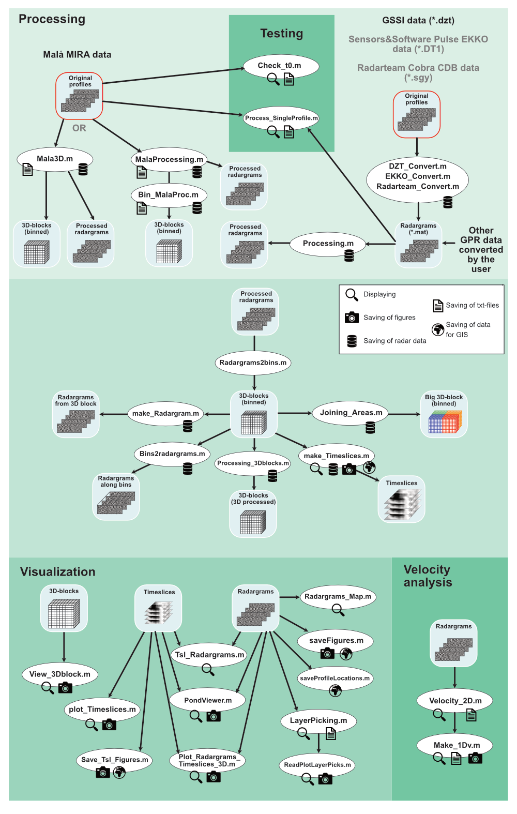

# Summary

Ground Penetrating Radar (GPR) is a popular geophysical method for near surface investigations using high-frequency electromagnetic waves for a broad range of applications such as archaeological prospection [e.g. @Trinks:2018], hydrology [e.g. @Annan:2005], urban infrastructure detection [e.g. @Pajewski:2019], geological mapping [e.g. @Buck:2024], permafrost investigations [e.g. @Westermann:2010] or soil science [e.g. @Gates:2023]. Pulsed electromagnetic waves are transmitted from a transmitter antenna, penetrate into the ground and are reflected and transmitted at interfaces until the reflected waves are recorded by a receiving antenna. For mapping, the transmitter and receiver antenna (=one channel) are mostly carried with a constant small offset between them along a profile. For applications requiring high spatial resolution multi-channel equipment is available collecting several parallel profiles with small profile spacing (e.g. 4 cm or 8 cm) in one swath. 

`MultichannelGPR` is a structured collection of MATLAB scripts and functions for processing, visualization and export of single- and multi-channel GPR data. Although it was originally intended and developed for the processing of multichannel Malå MIRA data, it evolved to a more general processing tool also for data from other systems, e.g. GSSI, and partially Sensors&Software and Radarteam. But as the needed input format is clearly defined, the user can input any GPR data from any system, if the data is converted into the required mat-format.
It is structured into various folders containing MATLAB scripts for specific purposes that are mainly data import, processing in 2D and 3D (or cross-channel for multichannel data), visualization and velocity analysis. Some Graphical User Interfaces (GUIs) for processing and visualization are also provided as well as export functionalities for georeferenced radargrams and timeslices for easy import into a Geographical Information System (GIS).
A first paper on `MultichannelGPR` was published initially in 2021 [@Wunderlich:2021] and the code was available on request from the author. It was used in some publications, mainly for archaeological prospection [@Corradini:2022; @Wunderlich:2022; @Corradini:2023; @Wunderlich:2023], but also for infrastructure mapping [@Karle:2022]. It is now available on GitHub [@fidgit] including a test data set and tutorial for easily getting started.

# Statement of need

`MultichannelGPR` was designed to overcome the more or less "black-box" commercial software packages provided together with the GPR systems. Although these are mostly complete processing and visualization packages producing nice results, the exact data processing flow is partly obscured and the data can be extracted only at certain stages in specified data formats. Additionally, these programs mostly run only under Windows and/or licensed on single computers. Using closed proprietary software the inclusion of special processing steps by the user is not possible.
 
To my knowledge, there are already following other free software packages available for GPR processing: The Matlab based programs (a) GPR-PRO [@Spanoudakis:2010], which, unfortunately, is unclear how it can be obtained, (b) matGPR [@Tzanis:2010], which is only applicable for single-channel data, not multichannel data, and (c) GPRlab [Xiong:2023], which is developed obviously in a similar time range as MultichannelGPR.
Two other softwares based on the language R and python are (a) RGPR [@Huber:2018] and (b) GPRpy [@Plattner:2020]. Except for matGPR, where it is explicitly mentioned, it is unclear if the programs can handle multichannel GPR data that need special processing steps.

Therefore, `MultichannelGPR` was developed in order to
- provide an open source and extendable processing tool for multi- and single-channel data.
- provide more control on the used processing steps including documentation for reproducible science.
- enabling data export at any stage of the processing workflow for control and visualization purposes.
- enabling a possibility (for more experienced Matlab users) to easily implement own processing functions.

The input multichannel Malå MIRA data consists of 8 or 16 parallel channels collected with 8 cm profile spacing in one swath, a configuration file and a GPS positioning file. After coordinate assignment to each trace, the best flow of processing steps has to be determined. Two GUIs are provided for this task (see \autoref{fig:workflow}): One for the determination of time zero and adjustment between the channels (Check_t0.m) and one for the order of further processing steps (Process_SingleProfile.m). The used processing steps and parameters can be saved and then used for the processing of the complete data set. After determining the processing steps, the main script for Malå MIRA data is Mala3D.m. It reads the data, applies the processing steps and bins the data on a rectangular grid with a defined grid spacing. Some measures for handling data larger than the computer memory are applied. All data is saved as Matlab-files and thus can also be read without the `MultichannelGPR` software.

Also other single-channel data by GSSI (and Sensors&Software and Radarteam, but not tested too well yet) can be imported and processed. The remaining scripts of `MultichannelGPR` can be used on the processed radargrams and binned data independently of their origin. Further routines include the creation of timeslices, the extraction of radargrams from the binned data, and 3D processing on the binned data.
The 3D blocks can be visualized and sliced in three directions using View_3Dblock.m. Both radargrams and timeslices can be compared using Tsl_Radargrams.m with a visual aid using a copied mouse pointer in both data sets. For picking of layers across the radargrams a script LayerPicking.m is provided. Radargrams and timeslices can be exported as georeferenced PNG images and imported directly into a GIS for producing publication-ready figures.
For experienced Matlab users, it is also possible (a) to use single processing functions for own specialised applications that are not covered by the standard processing flow, (b) to include own processing functions or (c) to extract data between processing steps for analysis. 

# Acknowledgements

The Malå MIRA equipment initiating this work was funded by the Deutsche Forschungsgemeinschaft (DFG, German Research Foundation) – Project-ID 290391021 – SFB 1266. I would like to thank S. Bäumler, E. Corradini, A. Fediuk, S. Fischer, M. Harms, S. Hildebrandt, A. Hinterleitner, A. Lohrberg, H. Stümpel and D. Wilken for their support.

# References
